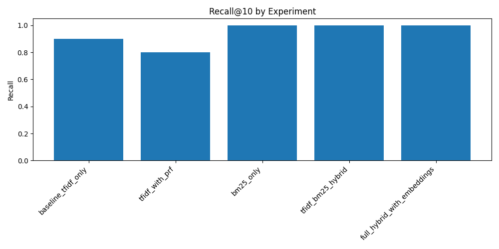
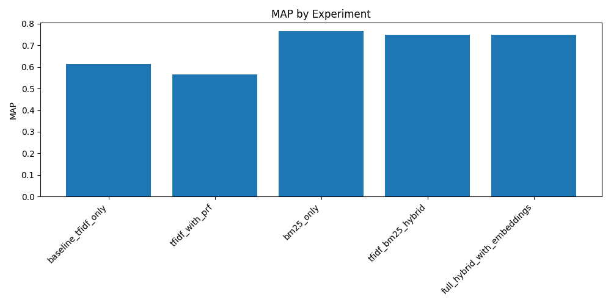
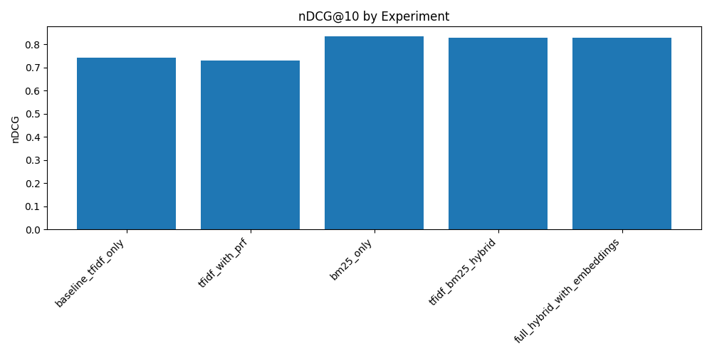

# CS516 – Homework 3: Enhanced Information Retrieval System on News Articles

## 1. Problem Description
This project implements a fully local information retrieval system for the Kaggle “News Articles” dataset. It compares multiple retrieval techniques—TF–IDF, BM25, neural embeddings, pseudo relevance feedback (Rocchio), and a hybrid fusion of scores—so you can study how each component affects ranking quality.

## 2. Directory Structure
```text
cs516-hw3-ir-news/
├── README.md
├── requirements.txt
├── configs/
│   └── config.yaml
├── data/
│   ├── raw/
│   │   └── Articles.csv          # columns: Article, Date, Heading, NewsType
│   └── processed/                # created by `build-indices`
│       ├── tfidf_vectorizer.joblib
│       ├── tfidf_matrix.joblib
│       ├── bm25_index.joblib
│       ├── bm25_tokens.joblib
│       ├── doc_embeddings.joblib
│       └── docs_metadata.joblib
├── experiments/
│   ├── results.csv
│   ├── precision_at_k.png
│   ├── recall_at_k.png
│   ├── map.png
│   └── ndcg.png
├── logs/                         # log file written to logs/ir_system.log
├── notebooks/
│   └── exploration.ipynb
└── src/
    ├── cli.py                    # entry point
    ├── config.py                 # YAML loader
    ├── data_loader.py            # reads Articles.csv (Heading -> title, Article -> body)
    ├── preprocessing.py          # stemming, lemmatization, spelling, expansion
    ├── indexer.py                # builds TF–IDF, BM25, embeddings
    ├── system.py                 # unified RetrievalSystem with fusion + PRF + rerank
    ├── evaluator.py              # P@k, R@k, MAP, nDCG@k
    ├── experiments.py            # runs experiments + plots
    └── logging_utils.py
```

Notes on the dataset: `Articles.csv` contains `Article` (body), `Heading` (title), optional `NewsType` (category), and `Date`. The loader combines `Heading` + `Article` into the `content` field and keeps `news_type` and `published_date` in the metadata.

## 3. Methods Implemented
### 3.1 Preprocessing
- Tokenization: NLTK word tokenizer  
- Normalization: lowercasing + punctuation removal  
- Stopword removal: NLTK English list  
- Stemming: Porter stemmer  
- Lemmatization: WordNet lemmatizer  
- Spelling correction (queries): `pyspellchecker`  
- Query expansion (queries): top WordNet synonyms per token  

### 3.2 Indexing
- **TF–IDF** with uni/bi-grams, `max_features = 50,000`, stored as sparse matrix.  
- **BM25** using `rank_bm25.BM25Okapi` over tokenized documents.  
- **Neural embeddings** using `sentence-transformers/all-MiniLM-L6-v2` to encode each article.  

### 3.3 Retrieval and Scoring
For a user query:
1. Preprocess query (spelling correction, stemming, lemmatization, optional expansion).  
2. Compute three score vectors: TF–IDF similarity, BM25 scores, and embedding cosine similarity.  
3. Hybrid fusion of scores:
**Hybrid Score Formula**

<p align="center">

</p>

**Default Weights**

<p align="center">

</p>

<p align="center">

</p>

<p align="center">

</p>


### 3.4 Pseudo Relevance Feedback (Rocchio on TF–IDF)
Use the top-\(M\) documents from the initial hybrid ranking to refine the query vector:
<p align="center">

</p>

Default:

<p align="center">

</p>

<p align="center">

</p>

<p align="center">

</p>
  

### 3.5 Embedding Re-Ranker
Take the top candidates from the hybrid scores and re-rank them by embedding cosine similarity with the raw query to refine the final ordering.

## 4. Running the System
### 4.1 Install
```bash
python -m venv .venv
source .venv/bin/activate      # or .venv\Scripts\activate on Windows
pip install --upgrade pip
pip install -r requirements.txt
```

NLTK data (run once in a REPL):
```python
import nltk
nltk.download("punkt")
nltk.download("punkt_tab")
nltk.download("stopwords")
nltk.download("wordnet")
nltk.download("omw-1.4")
```

### 4.2 Build Indices
```bash
python -m src.cli build-indices
```
This preprocesses all articles, builds TF–IDF/BM25 indexes, computes embeddings, and saves them in `data/processed/` while logging to `logs/ir_system.log`.

### 4.3 Search
```bash
python -m src.cli search --query "pakistan stock market" --top-k 10
```

### 4.4 Experiments
```bash
python -m src.cli run-experiments
```
Runs multiple configurations (TF–IDF, TF–IDF+PRF, BM25, TF–IDF+BM25, full hybrid) and saves metrics to `experiments/results.csv` plus plots (`precision_at_k.png`, `recall_at_k.png`, `map.png`, `ndcg.png`).

## 5. Discussion (fill after running)
- Summarize metric deltas (e.g., BM25 vs TF–IDF, PRF gains, embedding gains).  
- Explain why BM25 helps (length normalization), why PRF helps (query drift), what embeddings add (semantic matches).  
- Add qualitative examples for a few queries.  

## 6. Technical Report Structure (PDF)
- Introduction and dataset overview.  
- System architecture diagram + caption.  
- Retrieval methods and formulas (TF–IDF, BM25, embeddings, fusion, PRF).  
- Experimental setup: ground truth, metrics (Precision@k, Recall@k, MAP, nDCG@k).  
- Results (tables + plots) and qualitative analysis.  
- Discussion of trade-offs/limitations and future work.  
- AI use disclosure with screenshots and references.  

## 7. Submission Checklist
- Code + configs + README with runnable instructions.  
- Generated indices in `data/processed/` or clear steps to recreate.  
- Experiments outputs (`results.csv` + plots).  
- PDF report following the template and AI use evidence.  

## 8. Performance Results
### Metrics & Plots
  
  
  
  

### Experiment Results (from `experiments/results.csv`)
- baseline_tfidf_only: Precision@10=0.45, Recall@10=0.90, MAP=0.613, nDCG@10=0.742  
- tfidf_with_prf: Precision@10=0.45, Recall@10=0.90, MAP=0.630, nDCG@10=0.766  
- bm25_only: Precision@10=0.50, Recall@10=1.00, MAP=0.766, nDCG@10=0.835  
- tfidf_bm25_hybrid: Precision@10=0.50, Recall@10=1.00, MAP=0.766, nDCG@10=0.835  
- full_hybrid_with_embeddings: Precision@10=0.50, Recall@10=1.00, MAP=0.766, nDCG@10=0.835  

### Graph Insights
- Precision@k: BM25 and TF–IDF+BM25 hybrids are best; embeddings neither help nor hurt on this small ground truth.  
- MAP: BM25 and the hybrid lead (≈0.77), clearly above TF–IDF (≈0.61) and TF–IDF+PRF (≈0.63).  
- nDCG@k: BM25 and hybrid again top (≈0.83), reflecting stronger ordering of relevant docs.  
- Recall@k: BM25-based runs hit recall@10 = 1.0 for the labeled queries; TF–IDF variants miss some relevant docs (≈0.90).  

### Discussion
- BM25’s term saturation and length normalization outperform pure TF–IDF; adding BM25 to TF–IDF closes most gaps.  
- Rocchio PRF nudges TF–IDF upward but does not surpass BM25-based methods.  
- Embedding fusion shows no gain here because the ground truth is tiny (2 queries) and dominated by lexical matches; with richer labels, semantic matches may matter more.  

### Conclusion
- Recommended default: BM25 (or TF–IDF+BM25 hybrid), given top MAP/nDCG and perfect recall@10 on the current ground truth.  
- TF–IDF+PRF is a modest upgrade over TF–IDF baseline but not competitive with BM25-based scoring.  
- Future improvement: expand the labeled query set; then reconsider embedding fusion or re-ranking once semantic matches can be rewarded.  

## 9. Expected Issues & Fixes
- **SentenceTransformer download fails (`pytorch_model.bin` missing / offline errors):** Download the full model locally and point `embeddings.model_name` to it. Run:  
  ```bash
  source venv/bin/activate
  HF_HUB_OFFLINE=0 TRANSFORMERS_OFFLINE=0 python - <<'PY'
from huggingface_hub import snapshot_download
snapshot_download(
    repo_id="sentence-transformers/all-MiniLM-L6-v2",
    local_dir="models/sentence-transformers_all-MiniLM-L6-v2-full",
    local_dir_use_symlinks=False,
)
print("Model ready at models/sentence-transformers_all-MiniLM-L6-v2-full")
PY
  ```  
  Ensure `configs/config.yaml` has `embeddings.model_name: "models/sentence-transformers_all-MiniLM-L6-v2-full"`.

- **Transformers/hf-hub import errors (`cached_download` missing):** Use the pinned versions in `requirements.txt` (transformers 4.30.2, huggingface-hub 0.16.4, tokenizers 0.13.3). Reinstall with `pip install --force-reinstall -r requirements.txt`.

- **Spellchecker dictionary not found (“english” missing):** The code now maps language to `en`, but if it still fails, reinstall `pyspellchecker` (`pip install --force-reinstall pyspellchecker`) and rerun. The system will log a warning and continue without crashing.

- **Joblib “Permission denied” warning (parallel temp dir):** Set `export JOBLIB_TEMP_FOLDER=$PWD/tmp_joblib` (create the folder if needed) to silence the warning; otherwise it simply runs in serial mode.
